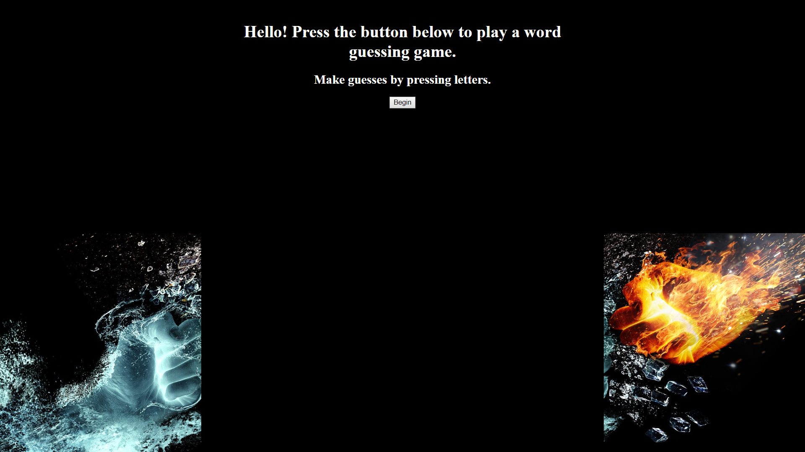

# Word-Guess-Game

###Overview###

1. this word guessing game is an exercise in pure javascript and can also be useful for learning new words in a fun way.
2. The game runs by responding to the user's keyboard inputs.

3. after the user guesses a word, the game will show them the definition of that word and allow the user to play the game again.

4. if you need any assistance with the game, contact the creator.
5. this game was created by Matthew Dwinell as a class project in March, 2019. Current and future contributions to the project are all from Matthew Dwinell.